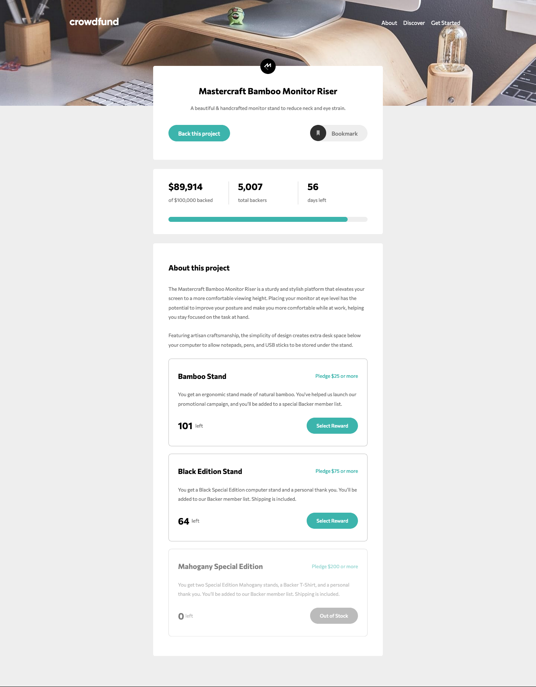

# Frontend Mentor - Crowdfunding product page solution

This is a solution to the [Crowdfunding product page challenge on Frontend Mentor](https://www.frontendmentor.io/challenges/crowdfunding-product-page-7uvcZe7ZR). Frontend Mentor challenges help you improve your coding skills by building realistic projects. 

## Table of contents

- [Overview](#overview)
  - [The challenge](#the-challenge)
  - [Screenshot](#screenshot)
  - [Links](#links)
- [My process](#my-process)
  - [Built with](#built-with)
  - [What I learned](#what-i-learned)
  - [Continued development](#continued-development)
  - [Useful resources](#useful-resources)
- [Author](#author)
- [Acknowledgments](#acknowledgments)

### The challenge

Users should be able to:

- View the optimal layout depending on their device's screen size
- See hover states for interactive elements
- Make a selection of which pledge to make
- See an updated progress bar and total money raised based on their pledge total after confirming a pledge
- See the number of total backers increment by one after confirming a pledge
- Toggle whether or not the product is bookmarked

### Screenshot

### Links

- Solution URL: [Add solution URL here](https://olgak169.github.io/FMCrowdfundChallenge/)
- Live Site URL: [Add live site URL here](https://olgak169.github.io/FMCrowdfundChallenge/)

## My process

### Built with

- Semantic HTML5 markup
- Sass
- Flexbox
- Valnila JS

### What I learned

Thinking ahead is a must!

### Continued development

Need to work on proper mark up from the beggining in order not to rewrite and edit for responsivness

### Useful resources

StackOverflow as always was a good help

## Author

- Frontend Mentor - [@yourusername](https://www.frontendmentor.io/profile/olgak169)

## Acknowledgments

Very entertaining challenge! Enjoyed JavaScript part of it the most!
